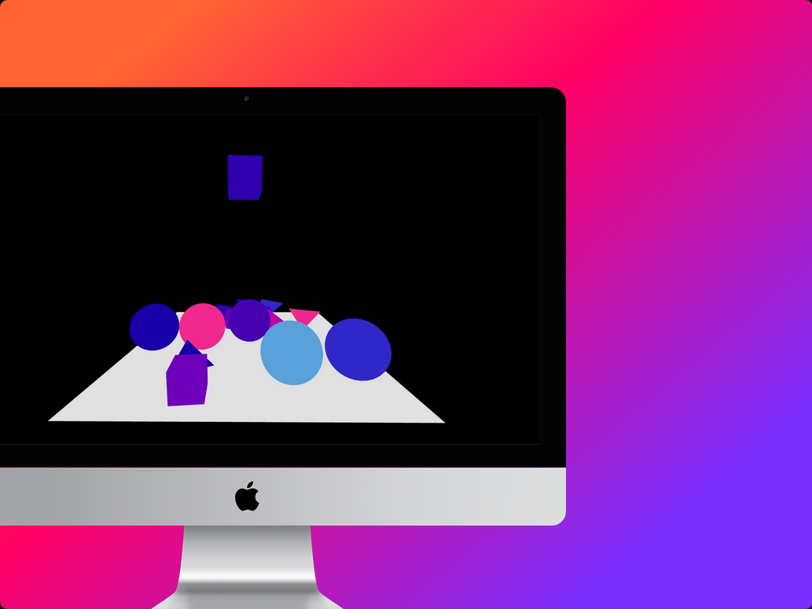
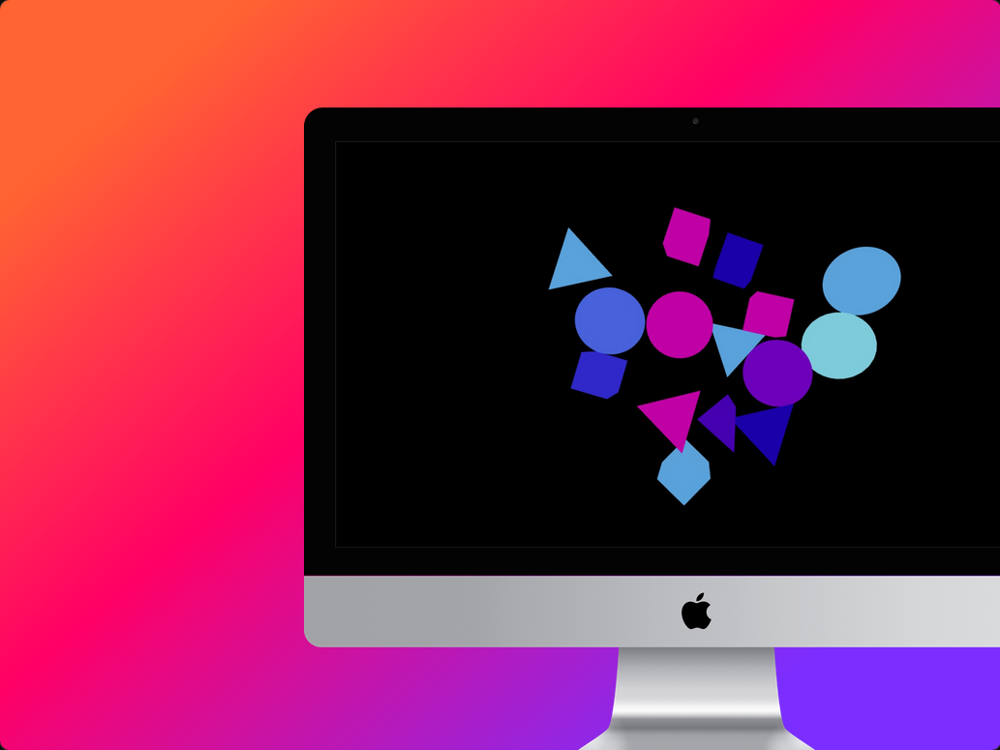
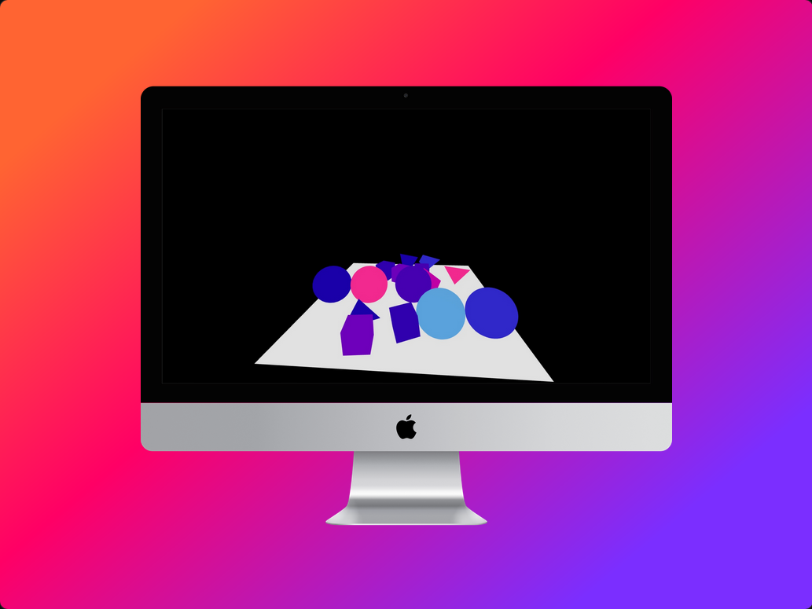

# Geometric Shapes

## Descripción del Proyecto

**"Geometric Shapes"** es un proyecto interactivo que presenta figuras geométricas (cubo, triángulo y esfera) en un entorno **3D** utilizando React y la biblioteca **@react-three/fiber** junto con **@react-three/cannon** para la simulación física. Las figuras caen desde la parte superior del contenedor y responden a clics del usuario aplicando fuerzas que les permiten moverse de manera realista. Además, las figuras están limitadas en sus movimientos para no salirse del contenedor. El usuario puede también mover la perspectiva de la cámara con el mouse para explorar la escena desde diferentes ángulos.

## Tecnologías Utilizadas

- **React.js:** Biblioteca para la construcción de interfaces de usuario.
- **Three.js:** Biblioteca para gráficos 3D en JavaScript.
- **@react-three/fiber:** Implementación de React para trabajar con Three.js.
- **@react-three/cannon:** Biblioteca para física en Three.js con React.
- **JavaScript:** Lenguaje de programación.
- **CSS:** Estilización de componentes.

## Experiencia en el Proyecto

Este es el primer proyecto en 3D que he desarrollado utilizando React. La experiencia ha sido desafiante y enriquecedora, ya que he aprendido a integrar la física en un entorno 3D y a gestionar la interacción de las figuras geométricas en tiempo real. He trabajado en la implementación de límites de movimiento y en la creación de una experiencia interactiva para el usuario, lo que me ha permitido mejorar mis habilidades en la programación 3D y en la gestión de estados en aplicaciones React.

## Capturas de Pantalla

A continuación se presentan algunas capturas de pantalla del proyecto en acción:

    <table>
        <tr>
            <td></td>
            <td></td>
        </tr>
        <tr>
            <td colspan="2"></td>
        </tr>
    </table>

## Agradecimientos

Quiero agradecer a la empresa **Ludik** por darme la oportunidad de realizar esta prueba técnica. Ha sido una excelente experiencia para poner a prueba y mejorar mis habilidades en desarrollo 3D con React.
